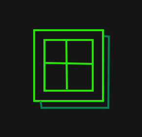
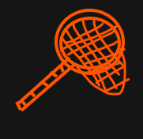

# Quick settings — the cog's panel

**BUILT 2026-09-20 on branch `thirteen`. The owner tried §1–§9 in the dev app the same day (58 `quick:part` lines in the dev log). §10's desk test (§10.1) is NOT RUN.**

## 1. What it is

The cog in the title bar opens the **quick panel**. Shut, the panel is one row: an
Apple Music logo, a Discord logo, and an **All settings** button. A press on a logo makes
the panel taller and shows that service's settings. A press on the same logo shuts them.
A press on the other logo swaps them.

The panel is the place for more services later. A **What's new** icon can join the row
when it has content (§6).

## 2. The owner's decisions (2026-09-20)

| Fork | Decision |
|---|---|
| Which button opens it | **The cog.** Its old job (Settings at full size) moves to the panel's *All settings* button. |
| What a logo shows | **The full sections**, and more than one section when more than one is relevant. |
| Logo color | **Black or white by theme**, both logos. The same rule as the Apple Music sigil. |
| What's new | **Later.** |
| Apple Music logo | **The sign-in row + Settings › Apple Music.** |
| Discord logo | **Settings › Discord + the one Discord row of Settings › Sharing.** |
| A second cog press | **Shuts the panel.** While Settings is grown, *All settings* reads *Collapse settings*. |
| Placement | **Under the cog**, in the Sound / Friends / Sleep panel family. |
| Review 1 (2026-09-20) | *All settings* becomes **a cog icon** (the title bar's glyph), and Collapse too. A **Window** icon (a framed 2×2 pane over a back pane, his sketch) holds the Window section. A **brush** icon holds the look and feel: Look schedule, the skin's own rows when the skin has any, Motion. **AirPlay** joins the Apple Music icon. |
| Review 2 (2026-09-20) | A **bug** icon (a beetle, his sketch) holds Updates + Bugs. A **reset** icon (a ring with two arrowheads, his sketch) holds all the Reset rows. Both sit in a **right cluster** beside the cog. |
| Review 3 (2026-09-20) | A **helipad** (an H in a ring, for help) holds Menus, hints and notices + Playback. A **robot** head (for agents) holds Connections. A **jellyfishing net** (the fun things, and the place for fun things to come) holds Song of the Day + Friends. |
| Review 4 (2026-09-20) | Tips stay OUT; a line at the top of the panel points to them. A **New badge** (an N in a disc, his sketch) on the top right of every square not yet pressed, black or white by theme (§8). The middle icons run **from the fewest rows to the most** (§9); Apple Music, Discord and the right cluster stay where they are. |
| Review 5 (2026-09-20) | The N badge is **kept for new settings**: it sits beside a new row's or section's own name (§10). It **clears on hover**. It shows in the **panel and the Settings card** both. A square **shows its N again** while a new row inside is unseen. First two: the **Friends** section (the net) and **Share activity on Discord** (the Discord square's Sharing row, the row only). |

## 3. The rows are the Settings card's own

`settings-card.ts` exports `mountSettingsParts(host, parts)`. It runs the card's own
`mountSettings` with a list of parts. A part is a section title, and optionally the row
ids to keep. So the Discord webhook field, the post log and every toggle work here
exactly as they do in the card. A change in one place redraws the other through
`onSettingsChange`, so they cannot disagree.

In parts mode the mount has no header, no search, no folds and no section move. Each part
draws under a plain sub-heading (`set__sub-head`), always open. A part that names rows
leaves out its section's tail (the tail speaks for the whole section). The mount never
takes a row request (`requestSetting`): the card takes it. Ctrl+F is not registered.

| Logo | Parts |
|---|---|
| Apple Music | the Account row (§4), then `Apple Music` (all 3 rows), then `AirPlay` |
| Discord | `Discord` (the SOTD webhook, Post as, Listen Along invite, the post log), then `Sharing` › `shareDiscord` only |
| Window | `Window` (all of it; its own first sub-heading "Window" is dropped, it would repeat) |
| Look (the brush) | `Look schedule`, `Skin settings` (left out when this skin has no rows), `Motion` |
| Updates and bugs (the beetle) | `Updates`, then `Bugs` (the report form, My reports, the app log) |
| Help (the helipad) | `Menus, hints and notices`, then `Playback` |
| Connections (the robot) | `Connections` (agent control, its settings, the extension) |
| Fun things (the net) | `Song of the Day`, then `Friends` |
| Reset (the ring) | `Reset` (all of it) |

The rows mount again on each logo press and each panel open. A mount reads a few cheap
local values (`settings_get`, `autostart_get`, `report_list`). It makes no Apple call.
`olderVersions` is one request per session, cached.

## 4. The Apple Music sign-in row

It is the title menu › Account › Apple Music row, a second copy. `main.ts` now collects
every `[data-acct-btn]`, `[data-acct-icon]` and `[data-acct-status]` and paints and wires
them all. So a sign-in started in one copy shows in the other. `initQuickPanel()` runs
before that code, because the copy must exist when `main.ts` collects them.

## 5. As built

- **Markup:** `index.html` — `.quick` wraps the cog and `#quick-panel` (`.pop app-scroll`,
  `data-frames="quick"`).
- **Module:** `src/quick-panel.ts` — the dropdown (`makeDropdown`, so it follows the
  hover-menu mode like Sound), the cog's turn (kept: every press adds `--cog-step`), the
  logos, the parts, *All settings*, and `openQuickPanel()` for the Compass.
- **Motion:** the `.pop` arrival. The bar's items enter with `enterRows` on open. A part's
  rows enter with `enterRows`. The height moves to the new content over `--pop-grow`
  (airplay.ts's shape; `.is-growing` hides the overflow meanwhile). Reduced motion: no
  movement.
- **Placement:** `left: 0` under the cog, origin top left. `keepRightInWindow` moves it
  left when a narrow window would cut its right edge (the mirror of `keepInWindow`).
- **Portaled menus:** a split half's `.set__menu` and a `.ctx-menu` count as inside, so a
  choice in them does not shut the panel.
- **Logos:** Apple's official monochrome Apple Music icon (from `apple-sigil.ts`) and
  Discord's official symbol (the brand kit's `Discord-Symbol-*.svg`), paths unmodified.
  Fills `--apple-music-mark` and `--discord-mark` (an alias of the Apple one — both kits
  have the same black and white files).
- **Control family:** the logos and *All settings* are **panel chips** (the Sound panel's
  pills): `--surface` fill, `--panel-border`, `--sound-chip-radius`, the picked fill when
  pressed. The glyph keeps its brand color when pressed.
- **Tokens (skin.css):** `--quick-panel-w` is the row's own sum from `--quick-icons` (10 → 346 px; a new icon adds one), `-max-h` / `-pad` (aliases of Sound's),
  `--quick-logo-size` (`--icon-lg`), `--quick-mark-size` (`--icon-sm`).
- **Over the row:** the Tips line, *Tips are in the Settings card itself!* A press shuts the panel and calls `requestSetting("tour")`: Settings opens with Tips unfolded and *Show the tour again* flashing.
- **The row, left to right:** Apple Music · Discord · Connections (the robot) · Fun things (the net) · Look (the brush) · Help (the helipad) · Window (§9), then the right cluster (`.quick__right` pushes it over): Updates and bugs · Reset · the cog.
- **The panel's cog:** the title bar cog's own SVG (copied in at start). A press turns the title bar cog, shuts the panel, and opens Settings at full size; while Settings is grown it collapses it, and the panel's cog wears the pressed fill. Its hint says which.
- **Window and brush icons:** drawn for this panel, stroked in the ink (`--text`, `--title` when pressed); the Window icon's back pane is `--subtext`. Not brand marks, so they take the theme.
- **Compass:** a Places row, *Quick settings*, opens the panel.
- **Log:** `quick:part` when a logo shows its part.
- **Hints:** the cog's hint changed; the logos and *All settings* are in the ONBOARDING.md ledger.

### 5.1 Decided inside his choices (for his review)

1. The panel's width is Sound's (300 px), the same shut and open, so it grows down only.
2. Each part has a plain sub-heading with its section's name ("Apple Music", "Discord",
   "Sharing").
3. The part you had open comes back when the panel opens again (for this session only).
4. The Compass row is named **Quick settings**, sub *Apple Music, Discord, window and look*.
5. The cog's hint: *Quick settings, grouped by what they are for, and the way to all of Settings*.
6. In hover-menu mode the cog opens the panel on hover, the same as every other title bar panel.
7. (Review 1) "Look and feel" is read as **Look schedule**: Settings has no section by that name.
9. (Review 3) Ten icons do not fit Sound's 300 px, so the panel widens to fit one row (346 px). In Mini (385 px wide) it still fits, moved in from the right edge.
10. (Review 3) The three new icons join the left group after the brush, in the order given. The robot leaves out the sketch's teeth: at 16 px they read as noise.
12. (Review 4) The Tips line reads *Tips are in the Settings card itself!* and is a link: it opens Settings at Tips (*Show the tour again* flashes). Hint: *Opens Settings at Tips*.
13. (Review 4) "Black and white versions per skin" is read as per THEME (light or dark), the rule the marks follow; a skin has no light or dark of its own.
14. (Review 4) The badge is on all ten squares, the panel's cog included, and *Show the tour again* brings them all back.
15. (Review 4) The order is fixed from the counts in §9, not re-sorted live.
11. (Review 3) Hints: *Help and playback: menus, hints and notices, and how songs play* · *Connections: the browser extension and AI agents* · *Fun things: Song of the Day and Friends*.
8. (Review 1) The icon order (Apple Music, Discord, Window, Look, then the cog apart at the end), and the panel's cog turning the title bar cog.

### 5.2 The owner's sketches (2026-09-20)

He drew each app icon; the SVGs in `src/quick-panel.ts` are drawn from these. Kept as the
record of what was asked for. The Apple Music and Discord marks are the official files, not
sketches.

| Icon | Holds | His sketch |
|---|---|---|
| Window | Window |  |
| Brush | Look schedule, Skin settings, Motion |  |
| Helipad (help) | Menus, hints and notices, Playback |  |
| Robot (agents) | Connections |  |
| Jellyfishing net (fun) | Song of the Day, Friends |  |
| Bug | Updates, Bugs |  |
| Reset | Reset |  |

## 6. Later

- **What's new:** an icon in the bar, after the logos. It shows this version's notes.
- **More services:** Last.fm is the next candidate (its account row + Settings › Last.fm).
  One entry in `PARTS`, one logo button.

## 7. Desk test

1. Press the cog. The panel drops under the cog with the two logos and *All settings*. The cog turns.
2. Press the cog again. The panel shuts. The cog turns again.
3. Open it. Press the Apple Music logo. The panel grows down. The sign-in row and the three Apple Music rows show.
4. Turn *Show ✓ on songs you have* off here. Open Settings › Apple Music: it is off there too.
5. Press the Discord logo. The rows swap to Discord + *Share activity on Discord*.
6. Press the Discord logo again. The rows shut and the panel shrinks.
7. Discord: press Connect, paste nothing, press away inside the panel. The panel stays open.
8. Change a light theme to a dark one: both logos turn from black to white.
9. The panel's cog: Settings opens at full size, the panel shuts, the title bar cog turns. Open the panel: the panel's cog is filled and its hint says *Collapse settings*. Press it: Settings goes back.
9d. A fresh look: every square wears an N badge. Press the robot: its badge goes, the others stay. Restart the dev app: the robot's badge is still gone. Dark theme: the discs turn white with a black N. Settings › Tips › Show the tour again: every badge is back.
9e. The Tips line at the top: a press shuts the panel, opens Settings with Tips open and *Show the tour again* flashing.
9f. The middle row reads robot · net · brush · helipad · window.
9c. The helipad shows Menus, hints and notices, then Playback. The robot shows Connections. The net shows Song of the Day, then Friends. All ten icons sit on one row.
9b. The beetle shows Updates then Bugs; a report typed there keeps its text while a row redraws. The ring shows every Reset row. Both sit right, beside the cog.
9a. The Window icon shows the Window section, one "Window" heading only. The brush shows Look schedule and Motion; under Glass or Ocean, Skin settings between them. The Apple Music icon shows AirPlay last.
10. Mini surface: the panel stays inside the window.
11. Settings › Menus: hover menus on. Hover the cog: the panel opens.
12. Ctrl+Space, type *quick*: the row opens the panel.
13. Sign out of Apple Music from the panel's row. The title menu › Account row shows the same state.

## 8. The New badge (Review 4)

A small disc with an **N** hangs on the top right corner of every square in the row (all
ten, the panel's cog included) until the first press on that square. It is the panel's
own onboarding: nothing else says the icons are there to be pressed.

- **State:** the settings key `quickSeen: string[]`, the `data-quick` ids pressed at least
  once (`"all"` = the panel's cog). Default `[]`, so every icon starts New, on an upgrade
  too. A settings key, not a localStorage once-key, for `onboardingStep`'s reasons. No agent
  spec: like `onboardingStep`, it is the app's own record, not a preference.
- **Off:** the first press on the square adds its id. The badge never comes back by itself.
- **Back:** Settings › Tips › *Show the tour again* (`restartWalk`) writes `[]` too.
- **Look:** `.quick__logo[data-new]::after`. `--new-badge` is the black or white of the marks
  beside it (`--apple-music-mark`), the N is the other one (`--new-badge-ink`), and a ring of
  `--menu-surface` stands it off the square's border. Tokens `--new-badge-size` (11 px),
  `-fs` (8 px), `-off` (−4 px), `-ring` (1.5 px).

## 9. The order: fewest rows first (Review 4)

The middle group is sorted once, by the rows each icon shows, counted from the code on
2026-09-20. The order is fixed: an icon never moves because a setting showed or hid a row.

| Icon | Rows | Why it ranges |
|---|---|---|
| Connections (robot) | 4 | — |
| Fun things (net) | 4–10 | Song of the Day's rows show only while it is on |
| Look (brush) | 5–14 | the schedule's rows follow its mode; Skin settings follow the skin |
| Help (helipad) | 14–16 | two Menus rows are gated |
| Window | 19 | — |

## 10. The N beside a new setting (Review 5)

The badge outlives the panel's own onboarding: it is how a NEW setting announces itself.

- **Flag:** one line in `NEW_MARKS` (settings-card.ts) — `{ section }` for a whole section,
  `{ section, row }` for one row. Today: the Friends section, and `shareDiscord` in Sharing.
  CLAUDE.md's build checklist (item 5a) says every new row or section gets one.
- **Where:** inline after the name — a row's label (`.set__label`), a section's fold header
  in the Settings card, a part's sub-heading in the panel. The same row code draws both
  places, so both show it. A part that names rows (the Discord square's Sharing) never shows
  a section badge, only its rows'.
- **Off:** the first time the pointer rests on the row, or anywhere in the section (the
  heading included). The seen key joins `quickSeen` as `row:<id>` / `sec:<title>`; every
  open copy redraws. *Show the tour again* brings back the square badges only, never these:
  the tour is about the app, not about what is new.
- **Existing users vs new ones (his call, 2026-09-20):** a mark stays until THAT user clears
  it — for an existing user, for as long as it takes. A brand-new install starts with every
  mark in `NEW_MARKS` already seen (`seedNewMarks`, from `isFreshInstall()` — the same
  first-run decision `onboardingStep` makes), because nothing there is new to them. A mark
  added in a later version IS new to them. The square badges are the tour, so a new user
  still sees those.
- **The square:** `unseenNewIn(parts)` — a square shows its N while any part it holds still
  has an unseen mark, even after its own first press. So the net and Discord squares wear the
  N again now.
- **Look:** `.new-badge`, the corner badge's own rule set (`--new-badge*` tokens, renamed from
  `--quick-new-*`), inline and without the ring.
- **Never retired:** a line stays in `NEW_MARKS` for good. For a user who cleared it, it is
  inert; for a new install it is pre-seen.

### 10.1 Desk test

1. Open the panel. The net and Discord squares show the N again.
2. Press the net. *Friends* has an N beside its heading. Rest the pointer on the Friends rows: the N goes, and the net's N goes.
3. Press Discord. *Share activity on Discord* has an N after its name; the *Sharing* heading has none. Rest the pointer on the row: it goes, and the Discord square's N goes.
4. `npm run dev:fresh`: a brand-new user sees N on every square, and NO N beside Friends or Share activity on Discord.
5. Settings card: with `quickSeen` cleared by hand (the dev app's localStorage), Settings › Friends and Settings › Sharing › Share activity on Discord show the same Ns; a hover there clears the panel's too.

## 11. The N on the title bar cog

> **Part:** built · 2026-09-21

The Settings panel helps a new user most, so the title bar cog (`#cog-open`) wears the N too.
The onboarding walk does not change.

- **On (his call, 2026-09-21):** until the first press on the cog, and again while any mark
  in `NEW_MARKS` is unseen (`unseenNewAny()`, settings-card.ts).
- **Off:** the first press on the cog adds `cog` to `quickSeen`. A New mark keeps it on until
  that mark is hovered.
- **Existing users (his call):** they see it once after the update too. `cog` is not seeded
  by `seedNewMarks`. *Show the tour again* puts it back with the square badges (walk.ts keeps
  only `row:` / `sec:` keys).
- **Look:** the corner disc of §8 on the button's top right corner, with no ring: the title
  bar has no surface of its own. The disc sits on the button, not the svg, so it does not
  turn with the cog.

### 11.1 Desk test

1. `npm run dev:fresh`: the title bar cog shows an N. Press it: the N goes. The squares keep theirs.
2. An existing profile: the cog shows an N once. With Friends still unseen, it stays after the press; hover the Friends rows and it goes.
3. Press the cog several times: the gear turns, and the N (while on) does not turn.
4. Settings › Tips › Show the tour again: the cog's N comes back.
